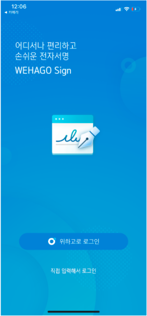
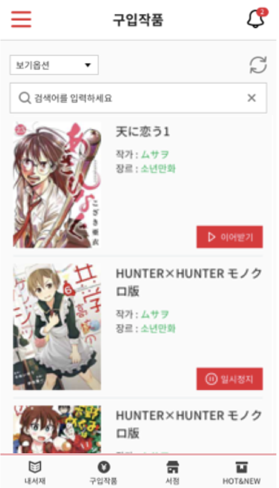
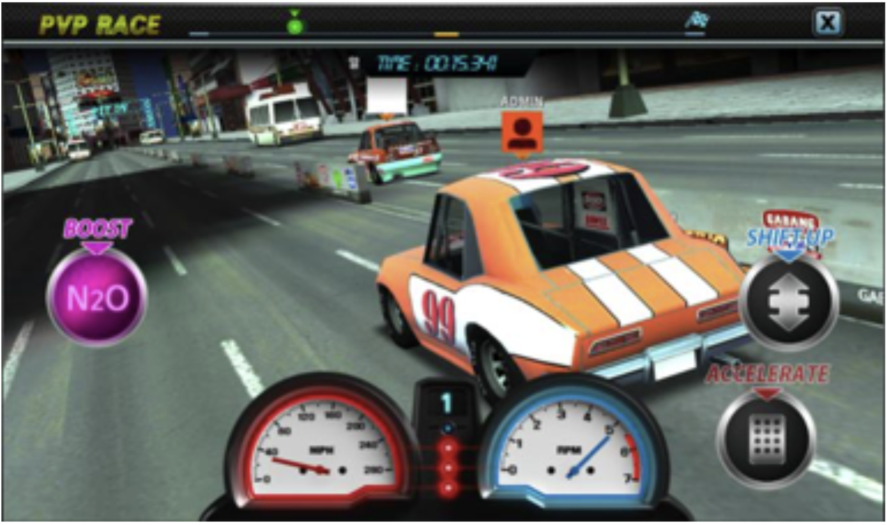

# 함형길

현업에 뛰어든지 10년차인 개발자이며, 도전하는 것을 즐거워하고, 모든 일에 자신감으로 임하려고 노력하며, 한번 일을 시작하면 끝을 봐야 직성이 풀리는 강한 책임감을 가지고 있습니다. 또한 어떤 일이든지 현실에 안주하지 않고 좀 더 발전적인 방향으로 나아가길 좋아합니다. 또한 새로운 기술도 열정적으로 받아들이며, 최근 수행한 업무에서 대부분 처음 접한기술들을 소화하며 개발팀을 이끌었고, 성공적으로 서비스를 운영중입니다.


# 보유기술

- React-Native(TypeScript)
  - 3개의 앱 개발
- iOS(Objective-C)
  - 5개의 앱 개발
- iOS(Swift)
  - 4개의 앱 개발
- Android(JAVA)
  - 2개의 앱 개발
- NodeJS(JavaScript)
  - 6개의 웹서버 개발/운영
  - 1개의 소켓 게임서버 개발 및 운영
- Database(MySql, MongoDB, Redis, ElasticSearch)
  - 3번의 mongodb replica set 구축, 1번의 sharding 서비스 운영 경험
  - 3번의 RDS 구축 및 사용
  - 1번의 Session Redis 시스템 구축, 1번의 실시간 게임순위 모듈 제작
- Etc(Python, C, C++, C#, php, jira, wiki, OrCad)
  - 다수의 빌드 python 스크립트 제작
  - Unity(C#), Cocos2dx(C++) 네트워크 모듈 제작
  - 펌웨어(AVR/MSP430)/회로설계(OrCad)

# 프로젝트

### 위하고원(블록체인 간편계약 모바일 앱)

> 개발기간 : 2020.07 ~ 2021.03
> (주)더존비즈온 > 모바일개발팀(팀장)

- Technical Lead

```sh
  React-Native(TypeScript, junit, Objective-C, Java)
  Redux pattern(redux-observable)
  Cache(SQLite, Typeorm)
  Security(Proguard, Rooting guard, RSA, AES)
  Dependency managment(yarn, pods, gradle, python script )
  CI/CD(Gitlab, FastLine)
```

- Participation

```sh
  채팅 서비스 개발(계약대화/개인대화)
  음성/화상 서비스 적용(Jitsi-Meet Library)
  소상공인 DID SDK연동(NativeModules),
  개인 DID 연동(SKT 이니셜 AppToApp)
  본인부인방지 모듈 제작(NICE 인증, PIN, FIDO)
```

- Project Lead

```sh
  개발프로세스: JIRA를 통한 이력 및 일정관리
  문서화: Confluence(WiKi) 활용
  Communication: 위하고(더존플렛폼)를 통한 팀 대화, Slack을 통한 외부 업체 대화
  보고서: 일일 보고서, 주간 보고서, 월간 보고서
  회의: 업무협의회의(기획팀, 디자인팀, 백엔드팀, 데브옵스팀), 월간 일정 회의
```

- People Managment

```sh
  React-Native/Redux pattern/Redux-observable 교육
  Reactive Progreamming 교육
  정기적 conferrence 운영
```
<div>


</div>

### 위하고 Sign

> 개발기간 : 2020.02 ~ 2021.04
> (주)더존비즈온 > 모바일개발팀(팀장)

- Technical Lead

```sh
  React-Native(TypeScript, junit, Objective-C, Java)
  Redux pattern(redux-observable)
  Security(Proguard, Rooting guard, RSA, AES)
  Dependency managment(yarn, pods, gradle, python script )
  CI/CD(Gitlab, FastLine)
```

- Participation

```sh
  개인키 관리 모듈 개발
  본인부인방지 모듈 제작(NICE 인증, PIN, FIDO)
  위하고 공통 로그인 모듈 제작
  메인 페이지 제작
```

<div>



</div>

### 위하고 iOS 앱(B to B 협업) 유지보수/고도화

> 개발기간 : 2019.05 ~ 진행중
> (주)더존비즈온 > 모바일개발팀(팀장)

- Technical Lead

```sh
  iOS(Swift4,5)
  Mvvm pattern(RxSwift, RxCocoa, xcode templates)
  Cache(SQLite, FMDB)
  Network(Alamofire, SwiftyJSON, Codable, CocoaMqtt)
  Security(CryptoSwift, RSA, AES)
  Dependency managment(pods)
  CI/CD(Gitlab, FastLine)
```

- Participation

```sh
  채팅서비스 멘션 기능 추가
  채팅서비스 읽음 처리 기능 추가
  채팅서비스 캐싱처리(SQLite)
  조직도 서비스 캐싱처리(SQLite)
  수임처관리 서비스 신규 제작
  청구서 관리 서비스 신규 제작
  카드매출 서비스 신규 제작
  로컬라이징처리(영어, 일본어)
  276개의 레거시 QA Jira 이슈처리
```

- People Managment

```sh
  Mvvm Pattarn 교육
  정기적 conferrence 운영
```

##### 메인/위톡/조직도/거래처
<div>


</div>

##### 카드매출관리

<div>


</div>

##### 수임처관리

<div>


</div>

### EOS 기반 게임 개발(DAPP)

> 개발기간 : 2018.09 ~ 2019.1
> 기븐텍(개인사업)

- Technical Lead

```sh
  Front End(Javascript, HTML5, css)
  Back End(node.js, express, nginx, pomelo framework)
  Database(Mongodb, mongoose)
  Auth(passport, passport-oauth2, express-session)
  Library(eosio.cbt, Pixi.js, scatter.js)
  aws(ec2, elb, route53 )
```

- Participation

```sh
  Scatter Login 제작
  EOS 기반의 코인 제작 EGG(eosgamez gamecoin)
  메인 웹 페이지 제작
  롤링 스카이 게임 제작
  스마트컨트렉트제작(Eosio.cbt)
  리얼다이스 소켓 게임서버 제작(EOS 블록 hashkey 실시간공유)
```
<div>


<!--  -->
</div>

### 자동매매, 시세차익봇(Py)

> 개발기간 : 2018.03 ~ 2018.8
> 기븐텍(개인사업) > 외주프로젝트

- Technical Lead

```sh
  GUI(window, ptyhon3, PyQt5)
  Network(exchange openApi(빗썸, 고팍스, 업비트, bitmax), Telegram openApi)
  Library(matlab plot)
```

- Participation

```sh
  주식캔들 제작, RSI 보조지표제작, stochastic 보조지표제작
  각 거래소 openapi 연동, Telegram openapi 연동
  매수/매도 로직제작
```
<div>


</div>

### Ebook iOS 앱 제작(에로가미 전자서적)

> 개발기간 : 2017.11 ~ 2017.12
> 소프트에이드(스타트업) > 외주프로젝트

- Technical Lead

```sh
  iOS(Swift3)
  Mvp pattern(RxSwift)
  Cache(SQLite, FMDB)
  Network(Alamofire, SwiftyJSON, Codable)
  Library(skyepub-lib)
  Security(CryptoSwift, AES)
  Dependency managment(pods)
```

- Participation

```sh
  Ebook 관리 기능(다운로드/삭제) 및 페이지 제작(내서재)
  Ebook Viewer 제작(epub viewer 제작, 책갈피, 메모, 형광펜 등 기능적용)
  Ebook store연결 및 javascript 처리(WebView)
```
<div>



</div>

### Ebook iOS 앱 제작(포도원)

> 개발기간 : 2017.08 ~ 2017.10
> 소프트에이드(스타트업) > 외주프로젝트

- Technical Lead

```sh
  iOS(Swift3)
  Mvp pattern(RxSwift)
  Cache(SQLite, FMDB)
  Network(Alamofire, SwiftyJSON, Codable)
  Library(skyepub-lib)
  Security(CryptoSwift, AES)
  Dependency managment(pods)
```

- Participation

```sh
  공지사항, 게시판 모듈 제작
  Ebook 관리 기능(다운로드/삭제) 및 페이지 제작(내서재)
  Ebook Viewer 제작(epub viewer 제작, 책갈피, 메모, 형광펜 등 기능적용)
  Ebook store연결 및 javascript 처리(WebView)
```
<div>


</div>

### 마루경마 예상지 웹서버 제작

> 개발기간 : 2017.02 ~ 2017.6
> 소프트에이드(스타트업)

- Technical Lead

```sh
  Back End(node.js, express, nginx)
  Database(Mongodb, mongoose)
  Auth(passport, passport-oauth2)
  aws(ec2, elb, route53 )
```

- Participation

```sh
  로그인 Backend 모듈 제작
  예상 배당판 예측 Backend 모듈 제작
  추천 번호 예측 Backend 모듈 제작(회귀식 사용)
  마사회결과 rss 구독 시스템 제작
```
<div>


</div>

### 더비베가스 게임 웹서버 제작(소셜 카지노 게임 - 경마, 슬롯, 빙고, 바카라)

> 개발기간 : 2016.02 ~ 2017.2
> 소프트에이드(스타트업)

- Technical Lead

```sh
  front end(kibana)
  Back End(node.js, express, nginx, logstash)
  Database(Mongodb, mongoose, ElasticSearch, redis)
  Auth(passport, passport-oauth2)
  aws(ec2, elb, route53 )
```

- Participation

```sh
  로그인 모듈 제작 제작
  경마 배팅 모듈 제작
  바카라 게임 모듈 제작
  빙고 게임 Backend 모듈 제작
  랭킹 시스템 제작
  게임 분석 로그 시스템 제작
```
<div>


</div>

### 태평왕전기 게임 웹서버 제작

> 개발기간 : 2015.10 ~ 2016.1
> 소프트에이드(스타트업) > 외주프로젝트

- Technical Lead

```sh
  Back End(node.js, express, nginx)
  Database(Mongodb, mongoose, redis)
  Auth(passport, passport-oauth2)
  aws(ec2, elb, route53 )
```

- Participation

```sh
  로그인 모듈 제작 제작
  아이템 모듈 제작
  게임 플레이 모듈 제작
  게임 레벨링 리소스 업데이트 시스템 제작
```
<div>


</div>

### 피트인레이싱 게임 웹서버 제작

> 개발기간 : 2015.10 ~ 2016.1
> 소프트에이드(스타트업) > 외주프로젝트

- Technical Lead

```sh
  Back End(node.js, express, nginx)
  Database(Mongodb, mongoose, redis)
  Auth(passport, passport-oauth2)
  aws(ec2, elb, route53 )
```

- Participation

```sh
  로그인 모듈 제작 제작
  아이템 모듈 제작
  게임 플레이 모듈 제작(일반/랭킹전/팀전)
  게임 레벨링 리소스 업데이트 시스템 제작
  랭킹 시스템 제작
```
<div>



</div>

### 마레다이브 게임 웹서버 제작

> 개발기간 : 2014.11 ~ 2015.1
> 소프트에이드(스타트업)

- Technical Lead

```sh
  Back End(node.js, express, nginx)
  Database(Mongodb, mongoose, redis)
  Auth(passport, passport-oauth2)
  aws(ec2, elb, route53 )
```

- Participation

```sh
  로그인 모듈 제작 제작
  아이템 모듈 제작
  게임 플레이 모듈 제작
  게임 레벨링 리소스 업데이트 시스템 제작
  랭킹 시스템 제작
```
<div>


</div>

### 모두의 빙고 게임 웹서버 제작

> 개발기간 : 2014.8 ~ 2014.11
> 소프트에이드(스타트업)

- Technical Lead

```sh
  Back End(node.js, express, nginx)
  Database(Mongodb, mongoose, redis)
  Auth(passport, passport-oauth2)
  aws(ec2, elb, route53 )
```

- Participation

```sh
  로그인 모듈 제작 제작
  아이템 상점 모듈 개발
  레벨링 스스템 개발
  매칭 알고리즘 제작
  랭킹 시스템 제작
  게임플레이 모듈 제작
```
<div>


</div>

### 에픽슬롯사가 게임 웹서버 제작

> 개발기간 : 2013.7 ~ 2014.8
> 아크로픽쳐스(스타트업)

- Technical Lead

```sh
  Back End(node.js, express, nginx)
  Database(Mongodb, mongoose, redis)
  Auth(passport, passport-oauth2)
  aws(ec2, elb, route53 )
```

- Participation

```sh
  로그인 모듈 제작
  슬롯 게임 모듈 제작
  랭킹 시스템 모듈 제작
  레벨 시스템 모듈 제작
  아이템 상점 모듈 제작
  퀘스트 모듈 제작
  리소스 및 스크립트 업데이트 모듈 제작
  자바스크립트 레벨링 tools 제작
```
<div>
<!--  -->


</div>

### 듣기왕 iOS 모바일 앱 제작

> 개발기간 : 2013.1 ~ 2013.3
> 비트비(스타트업)

- Technical Lead

```sh
  iOS(Objective-C)
  Mvc pattern
  Cache(SQLite)
  Network(Json parser)
  Library(Facebook/twitter/kakaotalk sdk, openAL, inapp)
```

- Participation

```sh
  랭킹 페이지 제작
  듣기 문제 풀이 모듈 제작
  영어공부 플레이어 제작
  결제 모듈 제작
```
<div>


</div>

### The Sixth Sense Zombie 게임 제작

> 개발기간 : 2012.8 ~ 20112.12
> 비트비(스타트업)

- Technical Lead

```sh
  iOS(Objective-C, voice-over)
  Mvc pattern
  Network(Json parser)
  Library(openAL, inapp)
```

- Participation

```sh
  3d 사운드 모듈 제작
  게임 플레이 모듈 제작
  결제 모듈 제작
```
<div>


</div>

### 에브리 앱 제작(Rss, 게시판 구독앱)

> 개발기간 : 2012.2 ~ 2012.7
> 비트비(스타트업)

- Technical Lead

```sh
  iOS(Objective-C)
  Mvc pattern
  Network(Json parser)
  Library(Facebook/twitter/kakaotalk sdk, inapp)
```

- Participation

```sh
  타임라인 제작
  수신함(최근,북마크,채널별) 제작
  채널 구독 센터 모듈 제작(전체구독, 키워드구독)
  알림채널 모듈 제작
```
<div>


</div>

### 다이어트 다이어리 iOS앱 제작

> 개발기간 : 2011.12 ~ 2012.2
> 기븐나우(개인사업)

- Technical Lead

```sh
  iOS(Objective-C)
  Mvc pattern
  Cache(SQLite)
  Network(Json parser)
  Library(Facebook sdk, inapp, admob, Charts)
```

- Participation

```sh
  음식리스트 관리
  운동리스트 관리
  음식/운동 입력
  일기 입력/수정 모듈 제작
  타입라인 모듈 제작
  달력 모듈 제작
```
<div>


</div>

### 기븐나우 iOS앱 제작

> 개발기간 : 2011.12 ~ 2012.2
> 기븐나우(개인사업)

- Technical Lead

```sh
  iOS(Objective-C)
  Mvc pattern
  Cache(SQLite)
  Network(xml parser)
  Library(Facebook/twitter/kakaotalk sdk, mapkit, apns)
```

- Participation

```sh
  공지사항 모듈 제작
  지도 기반 주변 쿠폰 정보 시스템 제작
  쿠폰등록 / 사용 모듈 제작
  쿠폰함 모듈 제작
  Push notification 기반 채팅 모듈 제작
  방명록 및 평가 모듈 제작
```
<div>


</div>


### W50 W70 W80 헤어아이론 개발 (JMW)

> 개발기간 : 2010.1 ~ 2011.2
> 기화정밀(연구원)

- Technical Lead

```sh
  C, C++
  DC 전원회로 설계
  AC 전원회로 설계
  히터 제어 회로 설계(AC제어)
  온도 센서 제어 회로 설계
  LED 및 비프음 제어
  C Firmware(AVR/Atmega)
  orcad(PCB 설계)
```

- Participation

```sh
  DC 전원회로 설계
  AC 전원회로 설계
  히터 제어 회로 설계
  온도 센서 제어 회로 설계
  LED 및 비프음 제어
  C Firmware(AVR/Atmega32)
  orcad(PCB 설계)
```
<div>


</div>

# 대학프로젝트
### 쿼드 콥터 ver1.0
> 개발기간 : 2008.2 ~ 2009.7
> 한림대학교 전자공학과(참여인원 7명)

- Technical Lead

```sh
  브러쉬리스 모터 제어
  브러쉬리스 모터 전원회로
  센서 제어(자이로(2개), 가속도, 초음파, 온도, 고도)
  C Firmware(AVR/Atmega128)
  프레임 제작(카본)
  모터 추력 테스트
  FM 송수신기 제어
  지그비(Zigbee) 통신
  SPI 통신(모터 컨트롤러와 통신)
  Uart 통신(zigbee와 통신)
```

- Participation

```sh
  브로쉬리스 모터 제어(PI)
  자이로 및 가속도 센서 칼만필터 사용 병합(5자유도 각도 출력)
  지그비(Zigbee) 통신(상태 정보 전달)
  제어 회로 설계
  프로그램 통합
```


### U.V.G (무인 자동차 ver2.0)

> 개발기간 : 2008.11 ~ 2009.2
> 한림대학교 전자공학과(참여인원 2명)

- Technical Lead

```sh
  지그비(zigbee) 통신
  Uart 통신
  TFT-LCD Control
  센서(가속도, 초음파) 제어
  스탭 모터 제어
  카메라 모듈 제어
  MFC(C++)
  C Firmware(AVR/Atmega128)
  ORCad
```

- Participation

```sh
  가속도 센서 제어
  초음파 센서 제어
  카메라 모듈 제어
  스탭 모터 P 제어
  지그비(Zigbee) 통신
  지그비 RSSI + 가속도센서 실내 위치 찾기
  프로그램 통합
  제어 회로 설계
```


### Heart Bit(SPO2) ver 2.0

> 개발기간 : 2008.9 ~ 2008.11
> 한림대학교 전자공학과(참여인원 8명)

- Technical Lead

```sh
  지그비(zigbee) 통신
  Uart 통신
  ORCad(PCB 설계)
  센서(SPO2) 제어
  전원회로 설계
  C Firmware(AVR/Atmega128)
```

- Participation

```sh
  지그비(Zigbee) 통신
  프로그램 통합
  전원 회로 설계
```


### U.V.G(무인 자동차 ver 1.0)

> 개발기간 : 2008.6 ~ 2008.10
> 한림대학교 전자공학과(참여인원 2명)

- Technical Lead

```sh
  지그비(zigbee) 통신
  Uart 통신
  TFT-LCD 제어
  가속도 센서 제어
  스탭 모터 제어
  카메라 모듈 제어
  C Firmware(AVR/Atmega128)

```

- Participation

```sh
  지그비(Zigbee) 통신
  Uart 통신
  가속도 센서 제어
  TFT-LCD 제어
  카메라 모듈 제어
  프로그램 통합
```


### Heart Bit(SPO2) ver 1.0

> 개발기간 : 2008.3 ~ 2008.6
> 한림대학교 전자공학과(참여인원 7명)

- Technical Lead

```sh
  지그비(zigbee) 통신
  Uart 통신
  캐릭터LCD 제어
  SPO2 센서 제어
  C Firmware(AVR/Atmega128)
```

- Participation

```sh
  지그비(Zigbee) 통신
  캐릭터 LCD 제어
  프로그램 통합
```


# 대외 공모전 경험

### 제5회 전파통신 시제품 경진대회(카이스트) - 은상

> 개발기간 : 2009.7 ~ 2009.11
> 한림대학교 전자공학과(참여인원 5명)

> 휴대전화가 오면, 블루투스 페어링된 인형이 좌우로 움직이는 시제품 개발

- Technical Lead

```sh
  블루투스(bluetooth) 통신
  Uart 통신
  신호 증폭 회로 설계
  신호 보정 회로 설계
  orcad(PCB 설계)
  Firmware(MSP430)
```

- Participation

```sh
  신호 증폭 회로 설계
  신호 보정 회로 설계
  PCB 설계
  프로그램 통합
```
